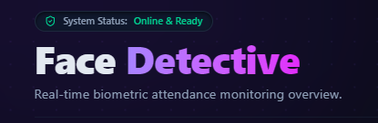

<div align="left">
  
</div>

# Attendance With Face Recognition

Welcome to the **Face Recognition With Attendance System**! This is a web-based, offline-capable application that allows users to register their faces and log attendance completely offline using client-side facial recognition. All data is securely handled on your device without relying on any backend or servers.

---

## 🎯 Features & Goals

- **100% Offline-First Execution:** Runs entirely in the browser, meaning no persistent connection is needed after the initial load.
- **Easy Face Registration:** Enroll users quickly using the device camera. 
- **Automated Attendance:** Employs face-matching logic to verify users and mark their attendance.
- **Admin Dashboard:** Provides real-time overviews, session setup, and record management.
- **Data Privacy:** LocalStorage/IndexedDB acts as the primary database, ensuring privacy is respected and latency is minimized.

---

## 🔑 Default Credentials

Because the system doesn't rely on an external database, the admin panel uses a default set of open-source credentials:
- **Admin Username:** `admin`
- **Admin Password:** `admin123`
- **Security PIN (View Records / Register Face):** `0027`

---

## 🛠️ Tech Stack & Requirements

### Tech Stack
- Frontend Framework: **React JS** 
- Styling: **Tailwind CSS**
- Animation: **Framer Motion**
- Face Recognition & Detection: Browser-based JS Web APIs
- Local Database: **LocalStorage / IndexedDB**

### System Requirements
- A modern web browser with decent performance (Chrome, Firefox, Edge).
- A functioning web-camera or device camera to scan faces.
- *Node.js* & *npm* (For developers to run the app locally)

---

## 📸 System Previews & Process Flow

Here is the visual process flow and features highlighted through screenshots of the actual website format:

### 1. Dashboard Interface
The main dashboard serves as the landing page and navigation hub of the system.


### 2. Session Setup
Administrators must configure a session first before any attendance can be actively logged for the day.


### 3. Register Face
Allows an individual user to submit their details and register their face into the local database securely.


### 4. Mark Attendance
Using the registered models, users look at the camera to verify their identity and seamlessly mark their presence.


### 5. Admin Overview
Provides total student/faculty counts, attendance status, and general metrics for administrators.


### 6. Records Management
Displays a comprehensive history of all recognized entries and logs, directly accessible within the browser. 


### 7. Exported Attendance Report
An example of the exported attendance data generated by the system in a spreadsheet format.


---

## 🚀 How to Run Locally

If you'd like to extend or run this project on your machine:

1. Open the project folder in your terminal.
2. Install all the necessary dependencies:
   ```bash
   npm install
   ```
3. Run the development server:
   ```bash
   npm run dev
   ```
4. Open the `localhost` link generated in your terminal to view the application!

*(Note: Make sure to allow camera permissions when the browser prompts you to use the core face recognition functionality.)*

---

## 👨‍💻 Creator

- **LinkedIn**: [Yash Awasthi](https://www.linkedin.com/in/yashawasthi27/)
- **Portfolio**: [yashportfolio27.netlify.app](https://yashportfolio27.netlify.app/)
